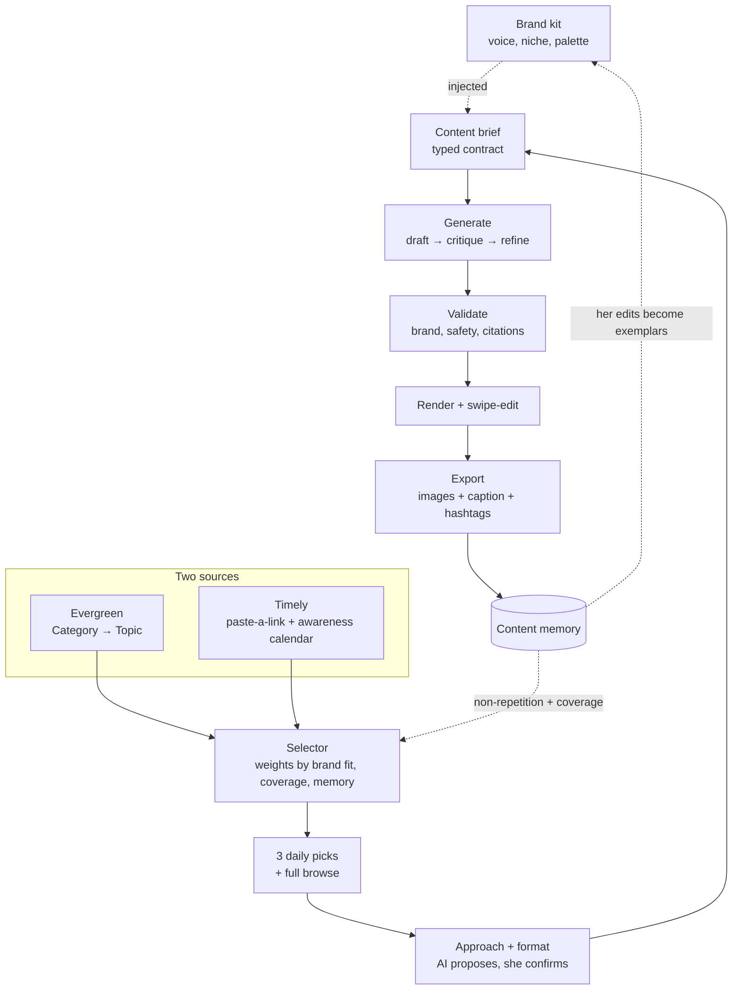
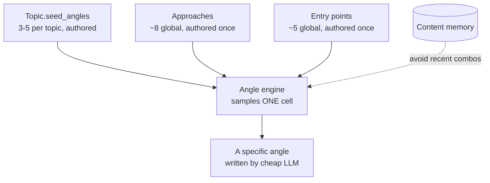
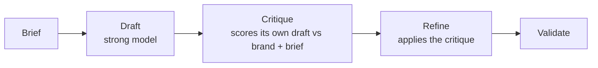
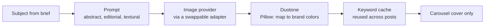
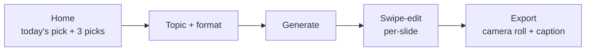
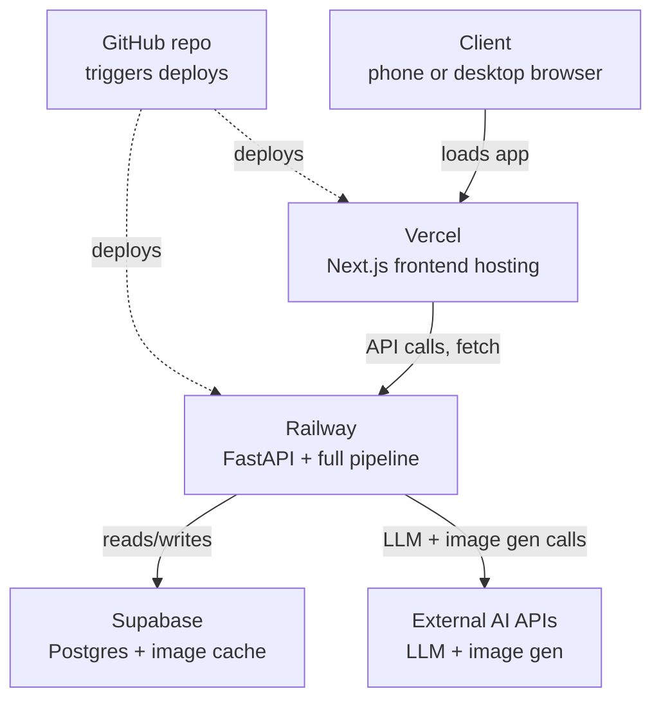
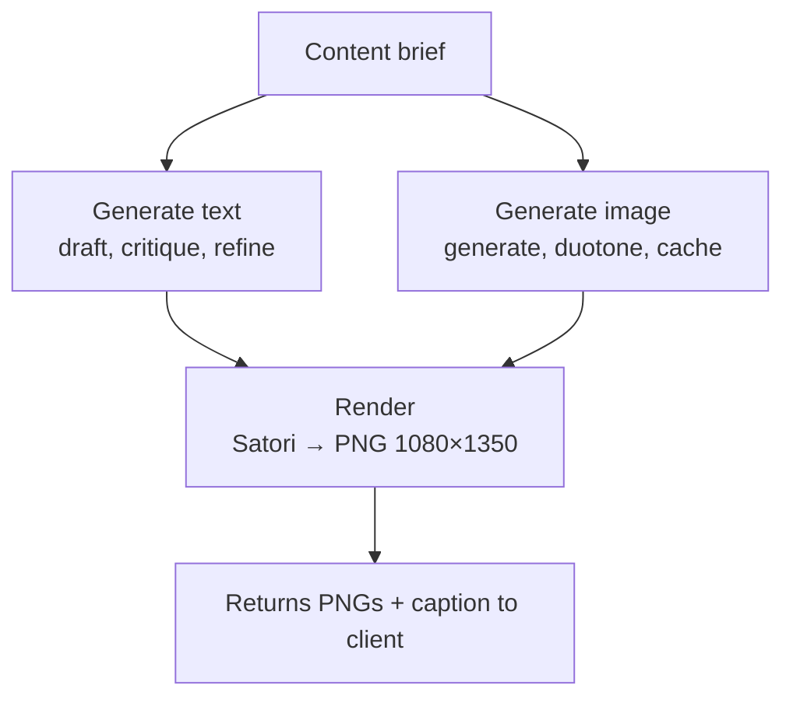

# Blueprint — AI Content Studio for a Women-Focused Instagram Brand

**Status:** Final reference design, frozen for Phase 1
**Owner:** Solo developer build · single creator · quality-first, cost-conscious where it doesn't cost quality

---

## 0. Project context & goal

A woman is starting a new Instagram presence from scratch, aimed at a women's audience, across the categories of mindset, career, wellness, women's health, relationships, society, and inspiring women. She is not a professional designer or copywriter, and building a consistent, high-quality content practice from a blank page is the hard part — not the idea, the *execution and consistency*.

The four problems this app exists to solve for her:

- **"What should I post today?"** — decision fatigue kills consistency before anything else does.
- **"How do I make it engaging?"** — a good topic isn't a good post; it needs a storytelling angle.
- **"How do I turn an idea into a polished visual?"** — she has no design background and no stock photo library.
- **"How do I avoid repeating myself?"** — as volume grows, sameness creeps in unnoticed.

**The app acts as a content strategist + creator assistant**, not a generic AI writer. Its core principle:

> She chooses the topic. AI proposes the storytelling approach. She chooses the presentation format. AI creates the content — in *her* brand voice, unified by *her* brand look.

**Who this is for:** one creator, built by one developer (the reader), for her own brand. Not a multi-tenant SaaS in Phase 1 — that possibility is deliberately deferred (Phase 3) so Phase 1 can go deep on quality rather than wide on infrastructure.

**What "done well" means here:** the danger with any AI content tool is producing well-structured but *generic* output — technically correct, structurally sound, and indistinguishable from a thousand other AI-run accounts. Every decision in this blueprint is weighted toward avoiding that: a strong brand-voice mechanism, a real design system instead of AI-generated visuals per post, careful non-repetition, and a self-critique pass on every piece of copy. The goal is a page that feels like *her*, not like a bot with her logo on it.

**Delivery target:** a single mobile-first web app, one URL, usable from her phone (primary) and desktop (secondary).

---

## 1. The decisions this rests on

1. **Category is for humans. Topic + dynamic angles are for intelligence.** Categories help her browse; they are not the knowledge model.
2. **The Brand Kit is a first-class layer**, captured once and injected into every generation. It's what turns generic AI content into *hers*.
3. **The Content Brief is the spine.** Everything upstream exists to fill it; everything downstream consumes it. Python owns the brief and its constraints; the LLM generates inside it; Python validates the output back against it.
4. **Author little, generate the variety.** A shallow Category→Topic tree is hand-authored. Angles are generated dynamically at runtime from small, structured, reusable lists — cheaper to build and less generic than a hand-authored concept graph.
5. **Two content sources, one pipeline.** Evergreen (taxonomy) and Timely (paste-a-link + awareness calendar) feed the same brief and generator.
6. **Never cite from memory.** Any factual claim (health, news) must be grounded in a real retrieved source, or not made at all.
7. **Quality over speed, cost controlled by design, not by cutting corners.** A self-critique pass on every text generation; cost is managed via model tiering, a hero-image-only layout, and an image cache with brand duotone — not by lowering the bar.
8. **No headless browser in the render path.** Rendering is a deterministic, browser-free service (Satori), decoupled behind a typed contract so the engine can change without the pipeline changing.
9. **The design system is fully specified before Phase 1 build begins**, validated through mockups rather than guessed at in code — palette, fonts, and template layout are locked inputs to Claude Code, not decisions left open during the build. A third-party design tool (evaluated: Canva's autofill API) was considered and declined in favor of keeping rendering free, deterministic, and code-owned.

---

## 2. Two-layer product model

She only ever sees the top layer. All the intelligence lives underneath it, invisibly.

```
USER EXPERIENCE (simple, ~4 taps)     INTELLIGENCE (powerful, invisible)
----------------------------------    -----------------------------------
Brand kit (once, at onboarding)       Brand voice + palette injected into every brief
      |
Sees 3 daily picks (or browses)       Selector: weights by brand fit, coverage, memory
      |
Taps one, picks a format              Angle engine samples a fresh combination
      |
Taps generate                         Brief assembled → LLM draft → critique → refine
      |                               Image generated → duotoned → cached
Swipe-edits, exports                  Content memory records it, feeds tomorrow's picks
```

She makes two real decisions: which topic, which format. Everything else is proposed to her with a one-tap accept.

---

## 3. System architecture — the full pipeline



Read the brief in the middle as the spine — everything above decides *what to say*, everything below *produces it*. The two dashed loops are what make the app improve rather than just run.

---

## 4. Brand Kit — the identity layer

Captured once at onboarding (~2 minutes), editable anytime, injected into every brief.

```python
class MoodPalette(BaseModel):
    primary: str                     # hex — duotone shadow
    secondary: str                   # hex — duotone highlight
    accent: str                      # hex — script word, masthead rule, CTAs

class VoiceRegister(BaseModel):
    poetic: list[str]                # calm, poetic — quotes, feelings, story/reflection content
    direct: list[str]                # grounded, direct — research/opinion content

class BrandKit(BaseModel):
    brand_name: str                  # full name, e.g. "Women's Growth Society"
    handle: str                      # e.g. "@womensgrowthsociety" — spelled out ONLY on
                                     # the closing template footnote (Section 12), for
                                     # content that circulates outside Instagram, where
                                     # the platform's own attribution is lost
    masthead_short: str              # e.g. "WGS" — appears on every slide
    niche: str
    audience: str

    voice_traits: list[str]
    voice_samples: VoiceRegister     # two registers, not one flat list — see below
    forbidden: list[str]             # phrasings/topics she will NOT use

    mood_palettes: dict[str, MoodPalette]   # keys: "wisdom" | "bold" | "celebratory"
    text_color: str                  # hex — shared across all three moods
    background_color: str            # hex — shared across all three moods
    font_heading: str                # bold structural font
    font_script: str                 # accent/emphasis font, used sparingly (one word)
    font_body: str                   # body copy + masthead labels

    default_tone: list[str]
    signature_cta: str | None = None
```

**Two voice registers, not one.** Rather than a single flat `voice_samples` list, the voice is deliberately split by the *kind* of content: **poetic + calm** for page-owned quotes and content about feelings and emotions, **grounded + direct** for research- or opinion-based content. Which register applies to a given post isn't guessed by the model — it's resolved deterministically by Python from the post's `approach`, via a small lookup table (Section 5):

```python
APPROACH_REGISTER = {
    "story": "poetic", "question_reflection": "poetic",
    "educational": "direct", "myth_vs_fact": "direct", "checklist": "direct",
    "stat_research": "direct", "framework": "direct", "common_mistakes": "direct",
}
```

`brief_builder` looks up the post's approach, resolves the register, and injects **only that list** into `ContentBrief.brand_voice_samples` — the brief itself never carries both, only the resolved one. Same pattern as mood resolution: the backend picks, downstream consumers just receive the answer.

**The compounding mechanism:** every export and every edit she makes appends to the matching register's list. Weeks in, generation pattern-matches to things she's actually approved, not to a static description of her voice. This is the single highest-leverage input against generic output.

**Locked values for Women's Growth Society (WGS)** — decided through direct review, ready to seed the real `BrandKit` row. **Note:** `voice_samples.direct` below was revised 2026-07-15 (logbook #30) — the original 5 samples were all workplace/meeting-themed, which was found to be actively pulling `draft_post` toward inventing office scenarios on topics that had nothing to do with work. This is a deliberate deviation from an otherwise-locked value; see the logbook for root cause and verification.

```python
WGS_BRAND_KIT = BrandKit(
    brand_name="Women's Growth Society",
    handle="@womensgrowthsociety",
    masthead_short="WGS",
    niche=(
        "Practical emotional intelligence and confidence-building for women "
        "unlearning people-pleasing and navigating career and self-worth."
    ),
    audience=(
        "Women in their 20s-40s building a career while learning to trust "
        "themselves, and craving steady, honest encouragement over empty positivity."
    ),
    voice_traits=["supportive", "trusted", "encouraging", "calm", "grounded-in-facts"],
    voice_samples=VoiceRegister(
        poetic=[
            "You don't have to shrink to keep the peace. Some rooms were never meant to hold all of you.",
            "The tears you're hiding today are just proof you're finally listening to yourself.",
            "Growth doesn't announce itself. It just quietly becomes the way you breathe.",
            "You're allowed to outgrow people who only ever loved the smaller version of you.",
            "Some days strength looks like getting up. Other days, it looks like finally resting.",
        ],
        direct=[
            "Rest isn't something you earn after you collapse. It's maintenance you schedule before your body forces the issue.",
            "Your cycle isn't an inconvenience you push through. It's data about your body you're free to actually use.",
            "Saying less to someone isn't cold. It's what happens once you stop over-explaining a decision that was already final.",
            "Research shows women are socialized to soften their opinions before they've even finished stating them. Naming the pattern doesn't undo it — but it's the first thing that has to happen.",
            "Confidence isn't a feeling you wait for. It's a skill you build one uncomfortable choice at a time.",
        ],
    ),
    forbidden=[
        "preachy", "bossy", "negative", "overly corporate", "fake positivity",
        "clickbait", "hustle-mindset language",
        "engagement-bait CTAs (e.g. 'comment ❤️ if...')",
    ],
    mood_palettes={
        "wisdom":      MoodPalette(primary="#4B3A6E", secondary="#F3EEF9", accent="#8A63D2"),
        "bold":        MoodPalette(primary="#8C3B2E", secondary="#F7E9DE", accent="#D9643F"),
        "celebratory": MoodPalette(primary="#6E4F17", secondary="#FCEDB8", accent="#E8A23D"),
    },
    text_color="#241C33",
    background_color="#FAF7FC",
    font_heading="Archivo Black",   # bold structural word — Google Font, free
    font_script="Alex Brush",       # elegant accent word — Google Font, free
    font_body="Inter",              # body copy, masthead labels — Google Font, free
    default_tone=["warm", "encouraging"],
    signature_cta="Follow us for daily reminders that help you grow.",
)
```

All three fonts are free, open-licensed Google Fonts — no purchase, no attribution requirement, and they redistribute cleanly as TTF files for the Satori render service (a factor that matters here, since a marketplace font can't simply be linked at render time — the actual font file has to be bundled).

---

## 5. Taxonomy and the angle engine — one system, two grains

This is the deliberate departure from a hand-authored concept graph, and it's worth being precise about what's authored once versus generated at runtime, because they are **not two separate structures** — the angle engine reads directly from the Topic object the taxonomy already defines.

### What's authored (once, small)

**Category → Topic**, shallow and hand-tuned, 40–60 topics for Phase 1 (narrow and deep beats broad and thin — topic metadata is what steers quality).

```python
class Topic(BaseModel):
    id: str
    name: str
    categories: list[str]            # multi-tagged — a topic lives in many categories
                                     # (every benefit of a "graph", no graph infra)
    primary_category: str            # the ONE category this topic counts against on the
                                     # masthead (e.g. "MINDSET NO. 14") — browsable under
                                     # many, counted under one
    tone_defaults: list[str]
    suitable_formats: list[Format]
    seed_angles: list[str]           # 3-5 EXAMPLE sub-concepts — this IS the topic-grain taxonomy
    knowledge_hints: list[str]
    requires_citation: bool = False
    sensitivity: Literal["normal", "health", "sensitive"] = "normal"
```

Plus three small **global** lists/mappings, written once, shared by every topic — this is the only other authored content:

```python
APPROACHES = ["educational", "myth_vs_fact", "checklist", "story",
              "stat_research", "question_reflection", "framework", "common_mistakes"]

ENTRY_POINTS = ["a_mistake", "a_question", "a_contrarian_take", "a_stat", "a_relatable_moment"]

APPROACH_REGISTER = {   # which voice register (Section 4) each approach draws from
    "story": "poetic", "question_reflection": "poetic",
    "educational": "direct", "myth_vs_fact": "direct", "checklist": "direct",
    "stat_research": "direct", "framework": "direct", "common_mistakes": "direct",
}
```

### What's generated (every time, at runtime)

The angle engine doesn't author anything — it **samples a combination** from what's already there and asks the model to fill it in:

```
angle = sub-concept (from Topic.seed_angles, extended by the LLM)
        × approach (from the global APPROACHES list)
        × entry point (from the global ENTRY_POINTS list)
```

Python — not the model — picks the cell (e.g. *active listening × common mistake × a relatable moment*), passes it to a cheap/fast LLM to draft the specific angle sentence, and checks it against recent `MemoryRecord`s for that topic so it doesn't repeat a combination already used. Even a modest topic with 5 seed sub-concepts × 8 approaches × 5 entry points gives 200 structurally distinct starting points before the model writes a single word — diversity is a combinatorial guarantee, not a hope.



### Mood tagging — piggybacked, not a new cost

Each post also gets tagged with one of three **duotone moods** — `wisdom`, `bold`, or `celebratory` — which selects which entry in `BrandKit.mood_palettes` colors that post's hero image and accent elements. This is decided by the *same* cheap-tier call that already writes the angle sentence (the response just includes one extra field), so it adds no API cost. A deterministic fallback to `wisdom` covers any ambiguous case. Mood is picked once per post and applied consistently across every slide in that post — a carousel never mixes moods, even though the feed as a whole varies post to post. Fonts, layout, background, and text color stay identical across all three moods; only the duotone pair and accent color shift, the same way a magazine's typography stays constant while a section's color mood changes.

### Coverage across the whole catalog

Sampling within one topic solves *depth*. **Breadth** — actually walking all 40–60 topics instead of orbiting five favourites — is the selector's job, not the angle engine's: content memory tracks which topics and approaches have gone stale, and the daily-pick selector weights toward neglected ones. Two mechanisms, two different jobs, no overlap.

---

## 6. Approaches & formats

**Format** = the visual container *she* picks. **Approach** = the content structure *AI* proposes. A small format set × the approach library above gives large variety from a tiny build.

**Phase 1 formats (two):**
- **Carousel** — **3–4 slides max** (tightened from the original 5–6: forces a tight cover → body → takeaway skeleton, cuts generation cost, and reads better — carousels rarely need more to make one point well).
- **Single image** — absorbs the quote card; one punchy stat/quote/insight.

**Canvas:** default **1080×1350 (4:5)** — fills the most feed space on mobile. Every template is designed with a **centered 3:4 safe zone** for text, faces, and logos, because Instagram's profile grid now crops previews to roughly 3:4 even though the feed itself shows up to 4:5 — this keeps the grid looking intentional without sacrificing feed height. (Not a hard requirement to revisit now — noted so it's not lost.)

**Every output is a package:** image(s) **+** caption **+** hashtag set, all from the same brief, all through the same critique pass.

---

## 7. The Content Brief — the contract

```python
class Source(BaseModel):
    title: str
    author: str | None
    url: str | None
    excerpt: str                     # only citable text — nothing outside this is invented
    retrieved_at: datetime

class ContentBrief(BaseModel):
    topic_id: str
    topic_name: str
    angle: str                       # from the angle engine
    approach: Approach
    goal: Literal["educate", "inspire", "reflect", "inform"]
    mood: Literal["wisdom", "bold", "celebratory"] = "wisdom"   # tagged alongside the angle

    format: Format
    slide_count: int                 # 1 for single image, 3-4 for carousel
    tone: list[str]
    brand_voice_samples: list[str]   # RESOLVED register only (poetic OR direct — see Section 4)
    signature_cta: str | None

    requires_citation: bool
    sensitivity: Literal["normal", "health", "sensitive"]
    sources: list[Source] = []

    hero_image_prompt: str
    max_words_per_slide: int = 30
```

---

## 8. Generation pipeline

### Model tiering

| Step | Model tier |
|---|---|
| Angle brainstorm (filling a sampled cell) | Cheap / fast |
| Daily-pick pitches | Cheap / fast |
| Carousel & caption copy | Strong |
| Critique / refine pass | Strong |
| Paste-a-link summarization | Strong (extraction itself is non-LLM) |

### Draft → critique → refine (text only, every post)



Not run on images — images are the cost centre; the two branches are independent so text quality never has to be traded against image spend.

### Validation (Python, against the brief)

Brand-voice fit and `forbidden` phrasings · citation check (every factual claim traceable to `sources`) · format constraints (slide count, word limits) · repetition check against content memory · a human-verify checkpoint on health and timely content before export.

---

## 9. Imagery pipeline

No stock library — images are generated, then unified with a **brand duotone**, which is the single best trick for hiding the "AI image" look and making heterogeneous outputs read as one brand.



**Rules that also cut cost:** one hero image per carousel (cover only — interior slides are typographic, which is both the more professional look and an ~80% cut in image generation); duotone is a deterministic Pillow post-process, not an API call, so it's nearly free; images are cached by keyword and reused, so "reshuffle" often costs nothing; prompts lean abstract/editorial/textural rather than literal people, avoiding uncanny faces and reading as more premium; the image provider sits behind an adapter interface so the (fast-moving, cheap) provider landscape can change without touching the pipeline.

---

## 10. Content sources & surfaces

- **Evergreen** — the 40–60 authored topics, browsable and searchable.
- **Timely, paste-a-link** — she pastes an article URL (e.g. a new law affecting women); fetch → extract → brief with the source pinned → generated as reporting-with-attribution, never assertion. Critique additionally checks the copy doesn't drift beyond what the article says.
- **Awareness-days calendar** — the one pre-loaded automated source (International Women's Day, Equal Pay Day, etc.) — predictable a year out, free content anchors.
- **Daily picks** — three curated (not random) suggestions, weighted by niche and enforced variety (never three of the same category, roughly 2 evergreen + 1 timely), date-seeded so they don't reshuffle mid-day. Only a hook + thumbnail concept is precomputed nightly per pick; the full carousel generates on tap. A limited reroll is the pressure-release valve.

---

## 11. Content memory

No vector DB needed at single-creator volume — a metadata table and a cheap fingerprint suffice.

```python
class MemoryRecord(BaseModel):
    id: str
    date: date
    topic_id: str
    category: str                    # Topic.primary_category, denormalized for fast counting
    angle: str
    approach: Approach
    format: Format
    mood: str
    hook: str
    fingerprint: str                 # topic + angle + approach
    source_ids: list[str] = []
    status: Literal["draft", "exported"]
```

Feeds the non-repetition filter (angle engine + daily picks) and the voice store (exported posts + her edits append to `BrandKit.voice_samples`). It's also what the masthead counts against: the running number on a post's masthead is `1 + count of MemoryRecords where category matches and status == "exported"` — a simple, deterministic Python query, no LLM involved.

---

## 12. Templates & design system

Built **first**, because it sets the quality ceiling nothing downstream can rescue. This entire system was validated through mockups before being written into spec — not guessed at in code — so the values below are decisions, not placeholders.

### Aesthetic direction

**Editorial magazine structure, warm lavender mood.** The throughline, arrived at by reviewing several reference directions: a masthead (label — rule — label) framing every slide like a running publication header, a stacked two-font headline (a bold structural word + one accent word in a script font — never more than one word gets the script treatment), a single duotoned photograph used only on the cover, and restrained vector/typographic decoration in place of photo collage or a mascot. No recurring illustrated character — considered and declined, both for the character-consistency problem inherent to prompting a "new" character each generation, and to avoid naming a specific studio's style in image prompts (a real IP/policy risk with named-style prompting).

### Fonts (all free Google Fonts — no license cost, redistributable as TTF for Satori)

| Role | Font | Used for |
|---|---|---|
| Structural headline | **Archivo Black** | The bold block word in a headline (e.g. "PAUSE") |
| Script accent | **Alex Brush** | Exactly one accent word/phrase per headline (e.g. "first."), the closing signature, the quote-card mark |
| Body / labels | **Inter** | Body copy, masthead labels, captions, stats |

### The three duotone moods

Fonts, layout, `background_color`, and `text_color` are identical across all three — only the duotone pair and accent color shift, so the feed reads as one brand with range, not three disconnected looks. Mood is tagged per post by the angle engine's existing cheap-tier call (Section 5) and applied consistently to every slide in that post.

| Mood | When it's used | Primary (shadow) | Secondary (highlight) | Accent |
|---|---|---|---|---|
| **Wisdom** | Reflective/analytical — educational, framework, research | `#4B3A6E` | `#F3EEF9` | `#8A63D2` |
| **Bold** | Declarative/confident — myth-vs-fact, common mistakes | `#8C3B2E` | `#F7E9DE` | `#D9643F` |
| **Celebratory** | Milestones, wins, awareness days, inspire-goal content | `#6E4F17` | `#FCEDB8` | `#E8A23D` |

Shared: `text_color = #241C33` (deep violet-black, not true black), `background_color = #FAF7FC` (warm off-white, lavender-tinted).

### The masthead — every slide's running header

A small structural row at the top of every slide: **`{masthead_short}` — rule — `{primary_category} NO. {n}`** (e.g. `WGS — MINDSET NO. 14`). It does two jobs at once: makes a lone screenshot instantly recognizable as hers even out of context, and signals what kind of post it is. Mechanics:

- `n` is computed deterministically — `1 + count of exported MemoryRecords sharing that primary_category`, zero-padded to two digits. No LLM involved.
- The count is **per-category, not per-post and not per-slide** — every slide within the same carousel shows the identical masthead, since swipe position is already handled by the platform's native carousel dots.
- Counting is **lifetime**, not reset annually, by default (simplest; a yearly reset is a one-line change later if wanted).

### The five templates

| # | Template | Photo? | Purpose |
|---|---|---|---|
| C1 | Carousel cover | Yes — hero, duotoned | Masthead, stacked headline (block + script), kicker line, photo anchored to bottom |
| C2 | Carousel body | No | Masthead, large statement with one script-accent phrase |
| C3 | Carousel closing | No | Masthead pinned top; takeaway → script-font signature → CTA sentence at real reading weight → tiny handle footnote (`@handle`, spelled out — the one place it appears), all centered as a group in the remaining space |
| S1 | Single image — quote | No | Masthead, oversized translucent script quotation mark behind the quote text |
| S2 | Single image — stat | No | Masthead, small kicker label, huge number in the structural font, one supporting line |

Only the cover carries a photo — interior and single-image formats are entirely typographic, which is both the more professional editorial look and the reason single-image posts and carousel interiors cost effectively nothing to generate. All five read from `BrandKit` tokens (mood palette, fonts, text/background color) so nothing is hardcoded per template — a palette or mood change re-skins the whole system. All designed inside the 3:4 safe zone (Section 6).

**On the closing slide's handle:** every slide already carries `masthead_short` ("WGS") at the top, but that alone isn't enough to find and follow the account if a slide is screenshotted and shared outside Instagram — so the closing slide's footnote spells out the full `handle` (`@womensgrowthsociety`) as the one place it appears in full. The CTA sentence above it is set at real body-copy weight, not squeezed into the small letter-spaced label style used for the footnote — a full sentence in that tighter styling reads as fine print, not a call to action.

**Layout convention for masthead-plus-centered-content templates** (closing, and similarly quote/stat): pin the masthead in normal flow at the top, wrap the remaining content in its own `flex: 1` container, and center *within that wrapper* — not with `justify-content` on the whole slide, which pulls the masthead down with everything else. This is now the standard pattern for any future template needing the same structure.

---

## 13. Mobile flow



**Export reality:** Instagram has no friendly posting API for this use case, so export = save image(s) to camera roll + copy caption/hashtags; she posts from the Instagram app. Worth prototyping the swipe-editor early and cheaply (throwaway slides, before templates are final) since it's the riskiest interaction on a phone.

---

## 14. Rendering — browser-free, deterministic, decoupled

**Why not Playwright:** it failed on Streamlit Cloud because that host lacks the system Chromium dependencies a headless browser needs — not because Playwright itself is wrong. But for a mobile-web product, the sophisticated fix is to avoid a browser in the render path entirely, not to relocate it.

**Why not client-side rendering:** screenshotting the DOM on her phone works, but it isn't the "sophisticated" render path being asked for here — it's inconsistent across devices and fonts, and gives up server-side determinism.

**The chosen approach: Satori + resvg**, run inside the Railway backend as its own service with a typed contract:

```
POST /render
  { template_id, resolved_slides[], brand_tokens, hero_image_url }
→ PNG(s) at 1080×1350
```

Satori (built by Vercel for OG-image generation) turns JSX/HTML-like markup and CSS into SVG with **no browser process** — deterministic, fast, nearly free (pure CPU), and it runs anywhere including serverless/edge. resvg rasterizes the result to PNG. It supports flexbox layout, custom fonts, background colors and images — everything the templates (background + type + one image) need. Its CSS subset is narrower than a full browser's, but the templates are simple enough to stay comfortably inside it.

Because rendering is its own service behind a contract, the engine is swappable: if a future template genuinely needs something Satori's CSS subset can't express, that one service is replaced with containerized headless Chromium (self-hosted on Railway in Docker) without touching anything upstream.

---

## 15. Deployment architecture



**One GitHub repo** is the single source of truth and triggers two independent deploys. **Vercel** builds and serves the Next.js frontend at a public URL. **Railway** (or Render) runs the FastAPI backend and the entire pipeline at its own public URL (`https://your-app.up.railway.app`). The frontend calls the backend via an environment variable (`NEXT_PUBLIC_API_URL`), and the backend restricts CORS to the Vercel domain. **Supabase** holds the Postgres database (Brand Kit, Topics, Content Memory) and doubles as storage for the duotoned image cache. Secrets (LLM key, image-gen key, DB connection string) live in Railway's environment variables, never in the repo.

Inside Railway, once a `/generate` request lands, text and image generation run as **independent parallel lanes** off the same brief — this is what lets them be tiered and costed separately, and it's why "reshuffle image" only reruns the image lane:



---

## 16. Technology stack

| Component | Responsibility |
|---|---|
| Next.js (Vercel) | Mobile-first frontend |
| FastAPI (Railway) | Orchestration — pipeline lives here |
| Pydantic | Data contracts: Brand Kit, Topic, Brief, Memory |
| Supabase (Postgres + Storage) | Taxonomy, content memory, image cache, brand kit |
| LLM provider adapter, tiered | Cheap model for angles/pitches, strong for copy/critique |
| Image provider adapter | Cheap image gen, swappable |
| Pillow | Duotone post-process |
| readability / trafilatura | Paste-a-link extraction |
| Satori + resvg | Slide rendering — no headless browser |
| GitHub | Single source, triggers both deploys |

No agents / LangGraph in Phase 1 — this is a deterministic Python control loop, not an agentic system.

---

## 17. Phase mapping

### Phase 1 — earn the wow (build in this order)

1. **Design foundation** — Brand Kit schema + capture flow; brand tokens; the 5–6 templates as static markup with placeholder content (prove the quality ceiling before any AI is wired in); the duotone pipeline + image cache; the Satori render service behind its `/render` contract.
2. **Data spine** — Topic metadata schema; author 40–60 topics; the approach + entry-point global lists; the Content Brief contract.
3. **Generation** — angle engine (structured sampling + memory filter); draft→critique→refine; validation; model tiering.
4. **Surfaces** — daily-picks selector (coverage-aware, date-seeded, pitch-only batch job); paste-a-link; awareness-days calendar.
5. **Mobile flow** — home → topic+format → generate → swipe-edit (prototype early) → export.
6. **Deployment** — GitHub → Vercel + Railway, Supabase wired in, CORS + env vars configured.

### Phase 2 — intelligence & scale
Automated news ingestion · richer recommendation · vector similarity (only if volume ever justifies it) · Story cards (9:16) · more topics & formats · scheduling / content calendar · performance feedback loop.

### Phase 3 — creator platform (only if it becomes multi-creator)
Community prompts · lead magnets · newsletter · audience engagement tools.

---

## 18. Explicitly NOT in Phase 1

Automated news feeds · vector DB · community / polls / newsletter / DM automation · analytics · scheduling · Story format · any video/Reels generation (static image export is the lane) · a third format · headless-browser rendering · client-side rendering · more than 3–4 carousel slides · more than ~6 templates · a recurring illustrated mascot/character · a third-party design tool in the render path (Canva autofill evaluated, declined — see decision 9).

---

## Appendix — one post, end to end

1. She opens the app. **Today's Pick**: *"Why emotionally intelligent women pause before reacting"* — chosen by the selector from brand fit + coverage + memory (evergreen source).
2. She taps → picks **Carousel**. AI proposes the **story** approach with a one-line reason; she accepts.
3. The **angle engine** samples a cell — *emotional regulation × story × a relatable moment* — from Topic seed angles and the two global lists, checked against recent memory for that topic. The same cheap-tier call tags this post's **mood as `wisdom`** (reflective content), which selects the violet palette from `mood_palettes`.
4. Python assembles the **Content Brief**, injecting `voice_samples`, tone, `mood`, and a `hero_image_prompt`. It also computes the masthead: this topic's `primary_category` is Mindset, and the count of previously exported Mindset posts is 13 — so every slide will read **`WGS — MINDSET NO. 14`**.
5. Text lane: strong model **drafts** 3 slides + caption, **critiques** its own draft against brand + brief, **refines**. Image lane (parallel): generates the hero, **duotones** it in the wisdom palette, checks the keyword cache first.
6. **Validation** passes — voice OK, no forbidden terms, within word limits, not a repeat.
7. **Satori renders** the cover + 2 body slides + closing at 1080×1350, all within the 3:4 safe zone, each carrying the identical `WGS — MINDSET NO. 14` masthead.
8. She swipes on her phone, tweaks a line, taps **reshuffle image** on the cover — only the image lane reruns.
9. **Export:** PNGs to camera roll, caption and hashtags copied. She posts from Instagram.
10. **Memory** records the fingerprint so tomorrow's picks and angle sampling avoid it; her edit is appended to `voice_samples`.

---

*Frozen as the product design reference. The separation that makes it work: **Category is for humans; Topic + dynamic angles are for intelligence** — a small authored surface, a combinatorial engine underneath, and a render path with no browser in it.*
